# Informe Técnico — Escalabilidad, Alta Disponibilidad y Observabilidad en AWS

**Asignatura:** Arquitecturas de Software
**Laboratorio:** Escalabilidad, Alta Disponibilidad y Observabilidad en AWS (AWS Academy Learner Lab)
**Autor:** Brayan Loaiza
**Región:** us-east-1 (N. Virginia)
**Cuenta:** AWS Academy Learner Lab — `voclabs/user4343313=Brayan_Loaiza`
**Fecha de ejecución:** 8 de julio de 2026 (hora local UTC-05:00)

Todas las capturas referenciadas están en [`images/`](./images), numeradas en el orden en que se ejecutó el laboratorio.

---

## 1. Diagrama de arquitectura implementada

Recursos reales creados en esta cuenta (nombres tomados directamente de la consola, no genéricos):

```
Internet
   │
   ▼
Security Group: sg-alb-scalability   (HTTP 80 ← 0.0.0.0/0)
   │
   ▼
Application Load Balancer: alb-scalability-ha
   DNS: alb-scalability-ha-58907924.us-east-1.elb.amazonaws.com
   Esquema: Internet-facing · AZs: us-east-1a (subnet-0abb5fd8...) y us-east-1b (subnet-08d86829...)
   │  Listener HTTP:80 → forward
   ▼
Target Group: tg-scalability-ha   (HTTP:80, HTTP1, health check /health)
   │
   ▼
Security Group: ssg-ec2-scalability   (HTTP 80 ← solo desde sg-alb-scalability; SSH 22 ← My IP)
   │
   ▼
Auto Scaling Group: asg-web-scalability
   Launch Template: lt-web-scalability (AMI propia: ami-web-scalability-arsw)
   Desired: 2 → 3 (durante la prueba de carga) · Min: 2 · Max: 3
   │
   ├── EC2 · us-east-1a · i-0193f52fbba68adb1
   ├── EC2 · us-east-1b · i-0213608764cbc5e1
   └── EC2 (lanzada por escalamiento / por reemplazo de falla)

(Instancia aparte, fuera del ASG — molde usado para crear la AMI)
EC2 base: web-scalability-base · i-0c8193e1dacfc8a86 · us-east-1d
```

---

## 2. Captura del Auto Scaling Group

`asg-web-scalability` creado a partir de `lt-web-scalability`, con capacidad deseada 2, mínima 2 y máxima 3.

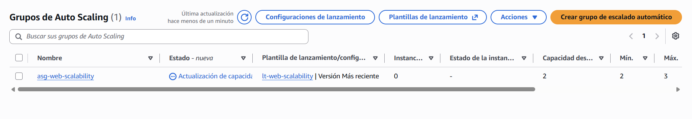

Durante la prueba de carga (Sección 6) la capacidad deseada y las instancias en servicio subieron de 2 a 3, confirmado por las métricas de CloudWatch del propio grupo:

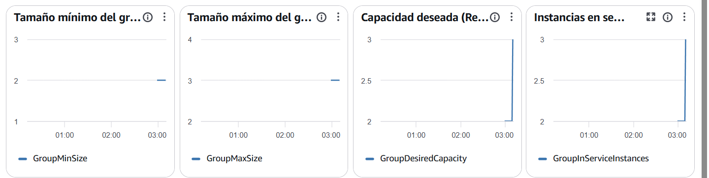

---

## 3. Captura del Load Balancer

`alb-scalability-ha`, Internet-facing, repartido en dos zonas de disponibilidad (`us-east-1a` y `us-east-1b`), con el listener HTTP:80 reenviando a `tg-scalability-ha`.

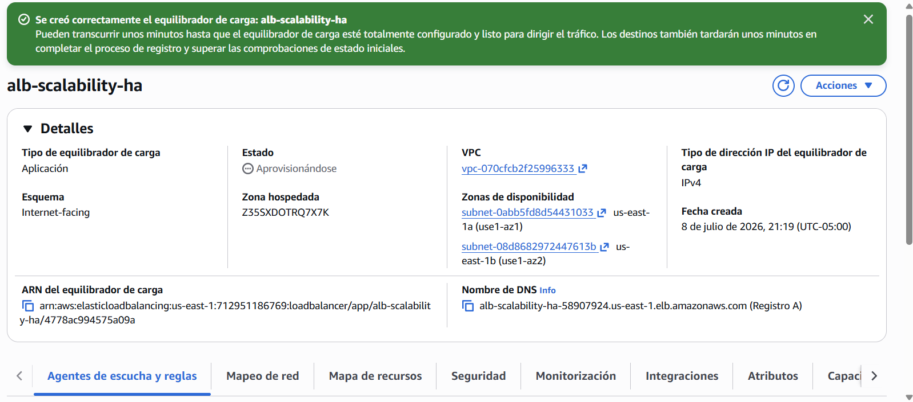

---

## 4. Captura del Target Group con targets Healthy

Las dos instancias registradas por el Auto Scaling Group (`i-0193f52fbba68adb1` en `us-east-1a` e `i-0213608764cbc5e1` en `us-east-1b`) pasaron el health check en `/health` y quedaron en estado **Healthy**:

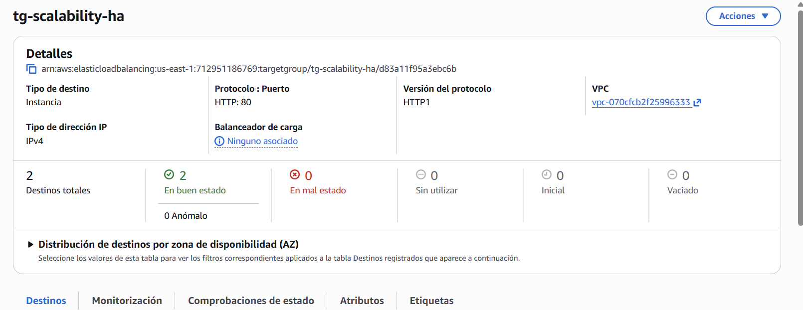

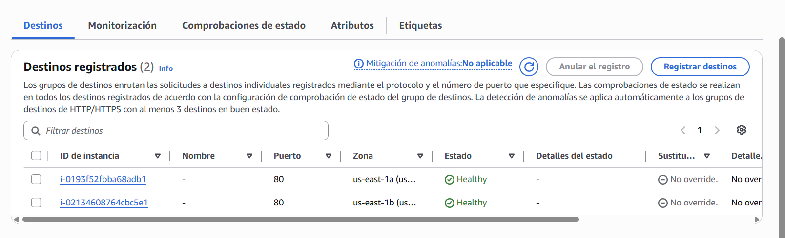

---

## 5. Evidencia de respuesta desde varias instancias

**Evidencia indirecta (confirmada):** el Target Group tiene registrados y sanos dos Instance ID distintos (`i-0193f52fbba68adb1` e `i-0213608764cbc5e1`, ver Sección 4), lo que confirma que el ALB tiene dos backends disponibles para repartir tráfico.

**Hallazgo abierto (sin resolver al momento de este informe):** al probar el DNS del balanceador directamente desde el navegador y también mediante un bucle de `curl`, todas las respuestas devolvieron consistentemente el `Instance ID` de la instancia base (`i-0c8193e1dacfc8a86`), la cual **no** aparece en la lista de destinos registrados del Target Group (Sección 4).

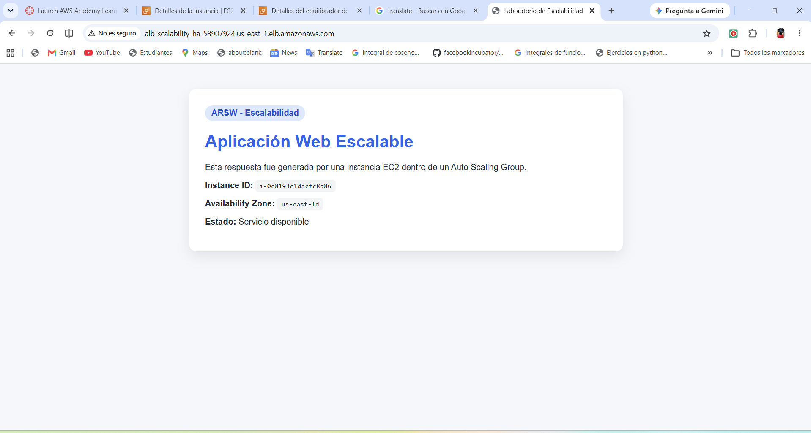
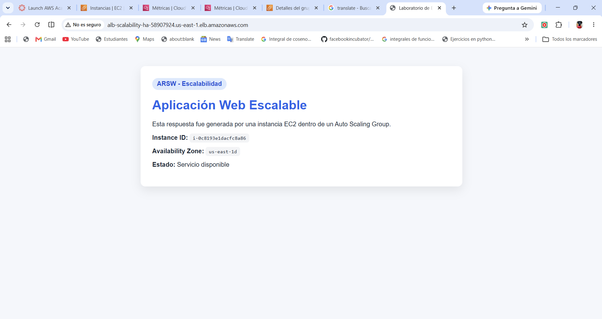

Esto es inconsistente y debería investigarse antes de una entrega final: lo más probable es que la instancia base haya quedado registrada manualmente en algún punto en `tg-scalability-ha` (contrario a lo que indica la guía) y luego retirada de la vista de "Destinos" por algún filtro, o que exista un segundo Target Group/registro que no quedó documentado en las capturas disponibles. **Recomendación:** revisar `Target Groups → tg-scalability-ha → Targets` en el momento de la entrega y, si la instancia base aparece ahí, anular su registro (*deregister*) para que el balanceador reparta tráfico únicamente entre las instancias del Auto Scaling Group.

---

## 6. Evidencia de escalamiento (o del intento)

Carga generada con `stress-ng --cpu 2 --timeout 300s` ejecutado por SSH en las dos instancias del Auto Scaling Group al mismo tiempo, para llevar el promedio de CPU del grupo por encima del umbral del 50% configurado en la política de target tracking:

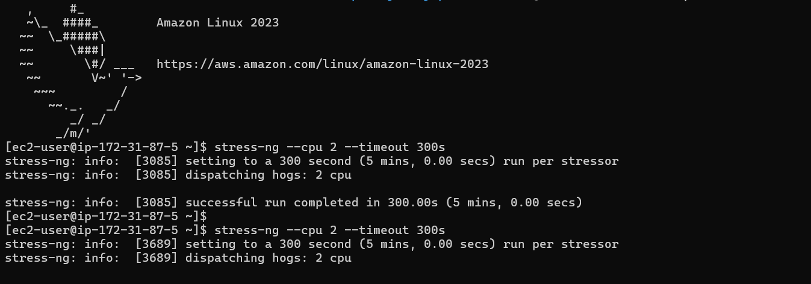
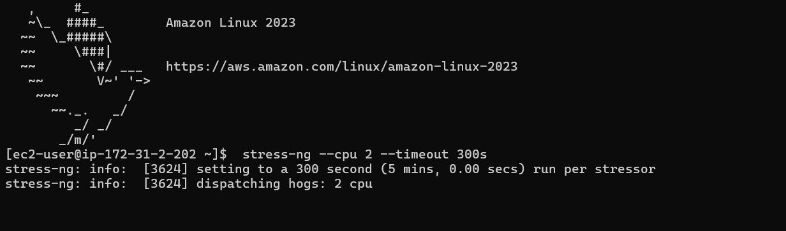

El promedio de CPU del grupo subió hasta **52.1%**, cruzando el umbral:

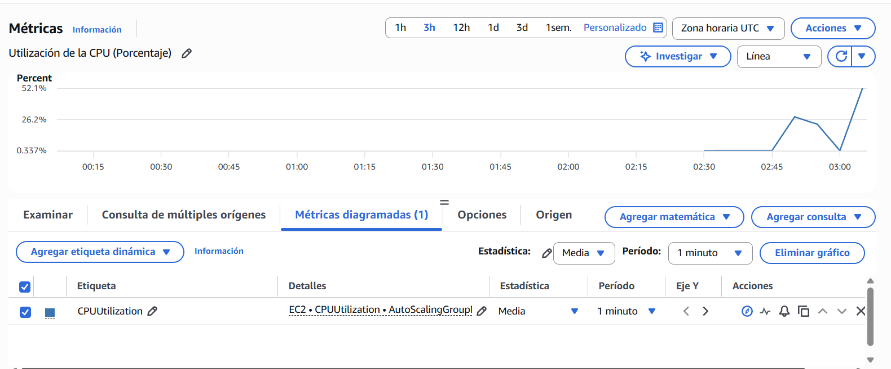

Consecuencia directa: la política de target tracking disparó el escalamiento y `GroupInServiceInstances` saltó de 2 a 3:

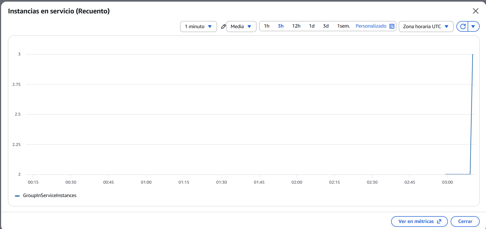

---

## 7. Evidencia de métricas en CloudWatch

Métricas revisadas: `CPUUtilization` (promedio del grupo), `GroupDesiredCapacity`, `GroupMinSize`, `GroupMaxSize`, `GroupInServiceInstances`, y el conjunto de métricas del Application Load Balancer (`HealthyStateDNS`, `HealthyStateRouting`, `AnomalousHostCount`, `RequestCountPerTarget`, entre otras) filtradas por el ARN real de `alb-scalability-ha`:


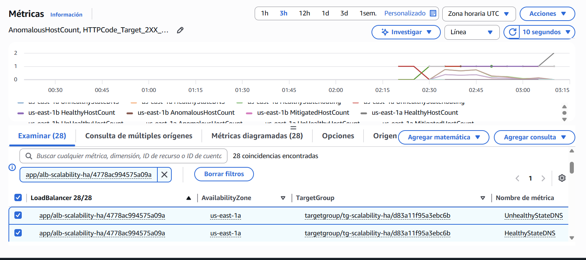

---

## 8. Evidencia de falla simulada y recuperación

Se detuvo manualmente una de las instancias del Auto Scaling Group para simular una falla:

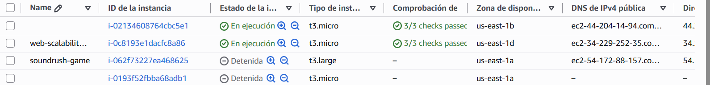

El Auto Scaling Group detectó, vía el chequeo de salud de EC2, que la instancia había sido detenida, la terminó por completo y lanzó una instancia de reemplazo — confirmado por el historial de actividad:

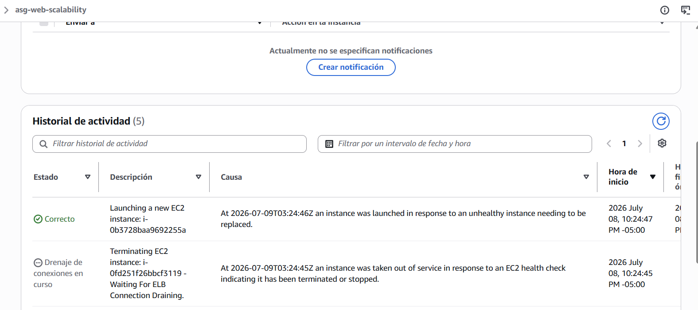

Registro textual del evento (UTC):

| Hora (UTC) | Estado | Descripción | Causa |
|---|---|---|---|
| 2026-07-09T03:24:45Z | Drenaje de conexiones en curso | Terminating EC2 instance: `i-0fd251f26bbcf3119` | *"an instance was taken out of service in response to an EC2 health check indicating it has been terminated or stopped"* |
| 2026-07-09T03:24:46Z | Correcto | Launching a new EC2 instance: `i-0b3728baa9692255a` | *"an instance was launched in response to an unhealthy instance needing to be replaced"* |

Esto confirma el comportamiento esperado de recuperación automática: el ASG no "revive" la instancia detenida, la reemplaza por una completamente nueva para restaurar la capacidad deseada.

---

## 9. Análisis de escalabilidad

El laboratorio implementó **escalabilidad horizontal** mediante un Auto Scaling Group con una política de *target tracking* sobre `CPUUtilization` promedio, objetivo 50%. La cadena de causalidad observada fue:

1. Carga sostenida de CPU en las dos instancias existentes (`stress-ng`, Sección 6).
2. El promedio de CPU del grupo cruzó el 50% y se mantuvo por encima el tiempo suficiente para que la alarma de CloudWatch asociada a la política confirmara la tendencia (no basta un solo punto de dato).
3. El Auto Scaling Group incrementó `GroupDesiredCapacity` de 2 a 3 y lanzó una tercera instancia a partir del mismo Launch Template.
4. La nueva instancia pasó su *health check grace period*, se registró en el Target Group y comenzó a recibir tráfico.

**Limitación observada:** usar solo CPU como métrica de escalamiento asume que el cuello de botella de la aplicación es de cómputo. Para una aplicación real que sirve mayormente contenido estático o hace I/O de red (como el `load.html` de este laboratorio), CPU puede no reflejar la carga real — de hecho, las pruebas de este laboratorio confirmaron que generar tráfico HTTP puro (sin `stress-ng`) no fue suficiente para disparar el escalamiento. Una métrica complementaria más representativa para una aplicación web sería `RequestCountPerTarget` (solicitudes por instancia), que sí captura presión de tráfico independientemente de cuánta CPU consuma cada solicitud.

Evidencia de la cadena causal descrita arriba:

| Carga aplicada | CPU del grupo reacciona | El ASG escala |
|---|---|---|
|  |  |  |

---

## 10. Análisis de alta disponibilidad

La alta disponibilidad se sostiene sobre tres mecanismos verificados en este laboratorio:

- **Redundancia geográfica:** el ALB y el Auto Scaling Group operan sobre dos Availability Zones (`us-east-1a` y `us-east-1b`), de modo que la caída de una zona completa no tumba el servicio.
- **Detección activa de fallos:** el Target Group ejecuta health checks HTTP cada 15 segundos contra `/health`; una instancia que falla dos chequeos consecutivos se retira de la rotación sin intervención humana.
- **Recuperación automática:** el Auto Scaling Group, con los health checks de ELB habilitados, no solo saca del tráfico a una instancia no saludable — la termina y lanza una de reemplazo para mantener la capacidad deseada (Sección 8). Este es el comportamiento que distingue *tolerar una falla* (ocultarla momentáneamente) de *recuperarse de una falla* (restaurar el estado deseado del sistema).

El atributo de calidad evidenciado directamente en la prueba de la Sección 8 es **disponibilidad (availability)**, con **resiliencia/auto-recuperación (self-healing)** como el mecanismo concreto que la sostiene.

Evidencia de los tres mecanismos, en orden:

| Redundancia + detección (targets sanos antes de la falla) | Se provoca la falla | El ASG se recupera solo |
|---|---|---|
|  |  |  |

---

## 11. Análisis de observabilidad

Las métricas revisadas permitieron reconstruir, sin acceder a los logs de la aplicación, toda la secuencia de eventos del laboratorio únicamente a partir de series de tiempo:

| Métrica | Namespace | Qué reveló en esta ejecución |
|---|---|---|
| `CPUUtilization` (avg, por ASG) | AWS/EC2 | Pico de 0.3% → 52.1% al iniciar `stress-ng` en ambas instancias |
| `GroupDesiredCapacity` / `GroupInServiceInstances` | AWS/AutoScaling | Salto de 2 a 3 instancias, correlacionado en el tiempo con el pico de CPU |
| Estado de destinos del Target Group | ELB (consola) | Confirmó 2/2 instancias `Healthy` antes de la prueba, y detectó la instancia detenida durante la simulación de falla |
| Historial de actividad del ASG | Auto Scaling | Bitácora textual exacta (con timestamp UTC y causa) de la terminación y el reemplazo de la instancia fallida |

La observabilidad lograda aquí es puramente de **métricas y eventos de infraestructura** — no hay logs de aplicación centralizados ni trazas. Esto fue suficiente para diagnosticar el comportamiento del sistema, pero no habría sido suficiente para diagnosticar, por ejemplo, un error de lógica dentro de la aplicación (ver Sección 12).

Los cuatro paneles que se cruzaron para reconstruir la secuencia:

| CPU del grupo | Capacidad del ASG | Estado de destinos | Métricas del ALB |
|---|---|---|---|
|  |  |  |  |

---

## 12. Propuesta de mejora para producción

Esta arquitectura resuelve el problema del laboratorio, pero para producción se recomienda:

- **HTTPS con AWS Certificate Manager (ACM)** en el listener del ALB — hoy el tráfico viaja sin cifrar.
- **Instancias privadas detrás del ALB**, sin IP pública, accesibles solo vía un bastion host o SSM Session Manager (no disponible en este Learner Lab, pero sí en una cuenta de producción).
- **NAT Gateway o VPC Endpoints** para que las instancias privadas puedan salir a Internet (`dnf update`, etc.) sin exponerse directamente.
- **CloudWatch Alarms explícitas** (no solo las implícitas de target tracking) para `UnHealthyHostCount > 0` y `HTTPCode_Target_5XX_Count`, con notificación a SNS.
- **Logs centralizados** (CloudWatch Logs o el *access log* del propio ALB hacia S3) — habría resuelto en minutos la anomalía descrita en la Sección 5, que con solo métricas quedó como hallazgo abierto.
- **Auto Scaling basado en `RequestCountPerTarget`**, combinado o en lugar de CPU, para reaccionar mejor a aplicaciones donde el cuello de botella no es de cómputo.
- **Infraestructura como código** (Terraform o CloudFormation) para que esta arquitectura sea reproducible, versionada y no dependa de pasos manuales en la consola — la principal fuente de inconsistencias encontradas durante este laboratorio (por ejemplo, el nombre `ssg-ec2-scalability` con una "s" de más respecto al Security Group planeado).
- **Despliegues blue/green** sobre el Target Group, para poder actualizar el Launch Template sin downtime y con posibilidad de rollback inmediato.

---

## Anexo — Registro fotográfico completo, en orden de ejecución

| # | Imagen | Paso del laboratorio |
|---|---|---|
| 01 | [sg-alb-basico](images/01-sg-alb-basico.png) | Creación de `sg-alb-scalability` |
| 02 | [sg-alb-reglas](images/02-sg-alb-reglas.png) | Reglas de entrada/salida de `sg-alb-scalability` |
| 03 | [sg-ec2-basico](images/03-sg-ec2-basico.png) | Creación de `ssg-ec2-scalability` |
| 04 | [sg-ec2-reglas](images/04-sg-ec2-reglas.png) | Reglas de `ssg-ec2-scalability` (HTTP desde el SG del ALB, SSH desde My IP) |
| 05 | [instancia-base-lanzando](images/05-instancia-base-lanzando.png) | Lanzamiento de `web-scalability-base` |
| 06 | [instancia-base-index](images/06-instancia-base-index.png) | Verificación de `/` en la instancia base |
| 07 | [instancia-base-health](images/07-instancia-base-health.png) | Verificación de `/health` → `OK` |
| 08 | [ami-disponible](images/08-ami-disponible.png) | AMI `ami-web-scalability-arsw` disponible |
| 09 | [launch-template](images/09-launch-template.png) | Launch Template `lt-web-scalability` |
| 10 | [target-group-destinos-vacios](images/10-target-group-destinos-vacios.png) | Creación de `tg-scalability-ha` sin destinos manuales |
| 11 | [target-group-creado](images/11-target-group-creado.png) | Confirmación de `tg-scalability-ha` |
| 12 | [alb-creado-confirmacion](images/12-alb-creado-confirmacion.png) | Confirmación de `alb-scalability-ha` |
| 13 | [alb-mapa-recursos-sin-destinos](images/13-alb-mapa-recursos-sin-destinos.png) | Mapa de recursos del ALB antes de asociar el ASG |
| 14 | [asg-creado-lista](images/14-asg-creado-lista.png) | `asg-web-scalability` creado (desired 2, min 2, max 3) |
| 15 | [instancias-ec2-lista](images/15-instancias-ec2-lista.png) | Instancias del ASG inicializando |
| 16 | [target-group-2-healthy-resumen](images/16-target-group-2-healthy-resumen.png) | 2/2 destinos Healthy (resumen) |
| 17 | [target-group-2-healthy-detalle](images/17-target-group-2-healthy-detalle.png) | 2/2 destinos Healthy (detalle por instancia) |
| 18 | [alb-respuesta-navegador-1](images/18-alb-respuesta-navegador-1.png) | Prueba del DNS del ALB (ver hallazgo, Sección 5) |
| 19 | [stress-ng-instancia-1](images/19-stress-ng-instancia-1.png) | Carga de CPU en la primera instancia |
| 20 | [stress-ng-instancia-2](images/20-stress-ng-instancia-2.png) | Carga de CPU en la segunda instancia |
| 21 | [cloudwatch-cpu-grupo](images/21-cloudwatch-cpu-grupo.png) | CPU promedio del grupo llegando a 52.1% |
| 22 | [cloudwatch-groupinservice-salto](images/22-cloudwatch-groupinservice-salto.png) | `GroupInServiceInstances` de 2 a 3 |
| 23 | [cloudwatch-dashboard-capacidad](images/23-cloudwatch-dashboard-capacidad.png) | Dashboard de capacidad del ASG |
| 24 | [cloudwatch-metricas-alb](images/24-cloudwatch-metricas-alb.png) | Métricas del ALB en CloudWatch |
| 25 | [instancia-detenida-simulacion-falla](images/25-instancia-detenida-simulacion-falla.png) | Instancia detenida para simular falla |
| 26 | [alb-respuesta-navegador-2](images/26-alb-respuesta-navegador-2.png) | Segunda prueba del DNS del ALB |
| 27 | [asg-actividad-recuperacion](images/27-asg-actividad-recuperacion.png) | Terminación + lanzamiento de reemplazo (recuperación automática) |
